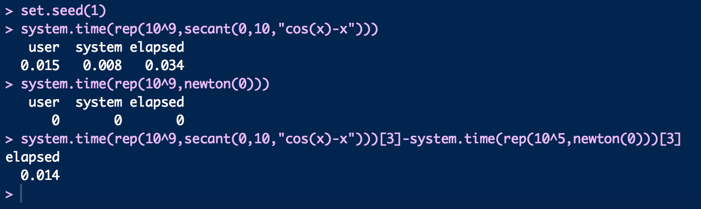

*Due Thursday, 18 October, 1:00 PM*

$5^{n=day}$ points taken off for each day late.

#37/40 Great job Yi!

40 points total.

Submit a single knitr file (named `homework5.rmd`), along with a valid PDF output file. Inside the file, clearly indicate which parts of your responses go with which problems (you may use the original homework document as a template). Add your name as `author` to the file's metadata section. Raw R code/output or word processor files are not acceptable.

Failure to name file `homework5.rmd` or include author name may result in 5 points taken off.

### Question 1 ###

**15 points**

A problem with the Newton-Raphson algorithm is that it needs the derivative $f'$. If the derivative is hard to compute or does not exist, then we can use the *secant method*, which only requires that the function $f$ is continuous.

Like the Newton-Raphson method, the **secant method** is based on a linear approximation to the function $f$. Suppose that $f$ has a root at $a$. For this method we assume that we have *two* current guesses, $x_0$ and $x_1$, for the value of $a$. We will think of $x_0$ as an older guess and we want to replace the pair $x_0$, $x_1$ by the pair $x_1$, $x_2$, where $x_2$ is a new guess.

To find a good new guess x2 we first draw the straight line from $(x_0,f(x_0))$ to $(x_1,f(x_1))$, which is called a secant of the curve $y = f(x)$. Like the tangent, the secant is a linear approximation of the behavior of $y = f(x)$, in the region of the points $x_0$ and $x_1$. As the new guess we will use the x-coordinate $x_2$ of the point at which the secant crosses the x-axis.

The general form of the recurrence equation for the secant method is:

$$x_{i+1} = x_i - f(x_i)\frac{x_i - x_{i-1}}{f(x_i) - f(x_{i-1})}$$

Notice that we no longer need to know $f'$ but in return we have to provide *two* initial points, $x_0$ and $x_1$.

**Write a function that implements the secant algorithm.** Validate your program by finding the root of the function $f(x) = \cos(x) - x$. Compare its performance with the Newton-Raphson method -- which is faster, and by how much?  For this example $f'(x) = -\sin(x) - 1$.

```{r}
# define the secant function
secant<-function(x0,x1,f){
  fun<-function(x) eval(parse(text=f))
  tol<-1e-8
  repeat{
    x_new=x1-fun(x1)*(x1-x0)/(fun(x1)-fun(x0))
    x0<-x1
    x1<-x_new
    if (abs(fun(x_new))<tol) break
  }
  return(x_new)
}
# find the root for f(x)=cos(x)-x
secant(0,10,"cos(x)-x")
```

The root for $f(x)=\cos x-x$ is 0.7390851.

```{r}
newton<-function(x0){
  f<-function(x) cos(x)-x 
  fd<-function(x) -sin(x)-1
  tol<-1e-8
  x.n<-x0
repeat{
  x.n.1<-x.n-f(x.n)/fd(x.n)
  x.n<-x.n.1
  if(abs(f(x.n.1))<tol) break
}
x.n.1
}
# validate the result
newton(0)
# compare the speed
set.seed(1)
system.time(rep(10^9,secant(0,10,"cos(x)-x")))
system.time(rep(10^9,newton(0)))
system.time(rep(10^9,secant(0,10,"cos(x)-x")))[3]-system.time(rep(10^5,newton(0)))[3]

```

Newton-Raphson method is faster by 0.014 second after $10^9$ simulation according to the screenshot (Figure 1) below. However, due to unknown reasons, the complied r markdown file didn't show the same output no matter how I tried. 



I believe you! Make sure to upload the picture to Github next time. I'll loop back around and check it when you do

### Question 2 ###

**20 points**

The game of craps is played as follows. First, you roll two six-sided dice; let x be the sum of the dice on the first roll. If x = 7 or 11 you win, otherwise you keep rolling until either you get x again, in which case you also win, or until you get a 7 or 11, in which case you lose.

Write a program to simulate a game of craps. You can use the following snippet of code to simulate the roll of two (fair) dice:

```{r}
  x <- sum(ceiling(6*runif(2)))
```

1. The instructor should be able to easily import and run your program (function), and obtain output that clearly shows how the game progressed.  Set the RNG seed with `set.seed(100)` and show the output of three games. (lucky 13 points)

```{r}
set.seed(100)
craps<-function(){
  x <- sum(ceiling(6*runif(2)))
  x2 <- 99
  if (x %in% c(7,11)) return("Win")
  else {
    while(x2 != x){
    x2 <- sum(ceiling(6*runif(2)))
    if (x2 == x) result <- return("Win")
    if (x2 %in% c(7,11))  result <- return("Lose")
    }
  }
}

replicate(3,craps())

```

2. Find a seed that will win ten straight games.  Consider adding an argument to your function that disables output. Show the output of the ten games. (7 points)

```{r}
i<-0
outcome<-0
while(outcome!=10){
  i=i+1
  set.seed(i)
  outcome<-sum(replicate(10,craps())=="Win")
}
i
set.seed(880)
replicate(10,craps())

```

(-3) While your output is good, and the seed you found correct, you did not provide output that "clearly shows how the game progressed." Something like printing `x` for each roll is useful in seeing game progression!

### Question 3 ###

**5 points**

This code makes a list of all functions in the base package:

```{r eval=T}
objs <- mget(ls("package:base"), inherits = TRUE)
funs <- Filter(is.function, objs)
```

Using this list, write code to answer these questions.

1. Which function has the most arguments? (3 points)
```{r}
which.max(unlist(lapply(funs,function(x) length(formals(x)))))
length(formals(funs[["scan"]]))
```
So `scan` function has the most arguments, with 22 arguments in total.

1. How many functions have no arguments? (2 points)
```{r}
sum(unlist(lapply(funs,function(x) length(formals(x))))==0)
```

So 226 functions have no arguments.

Hint: find a function that returns the arguments for a given function.
